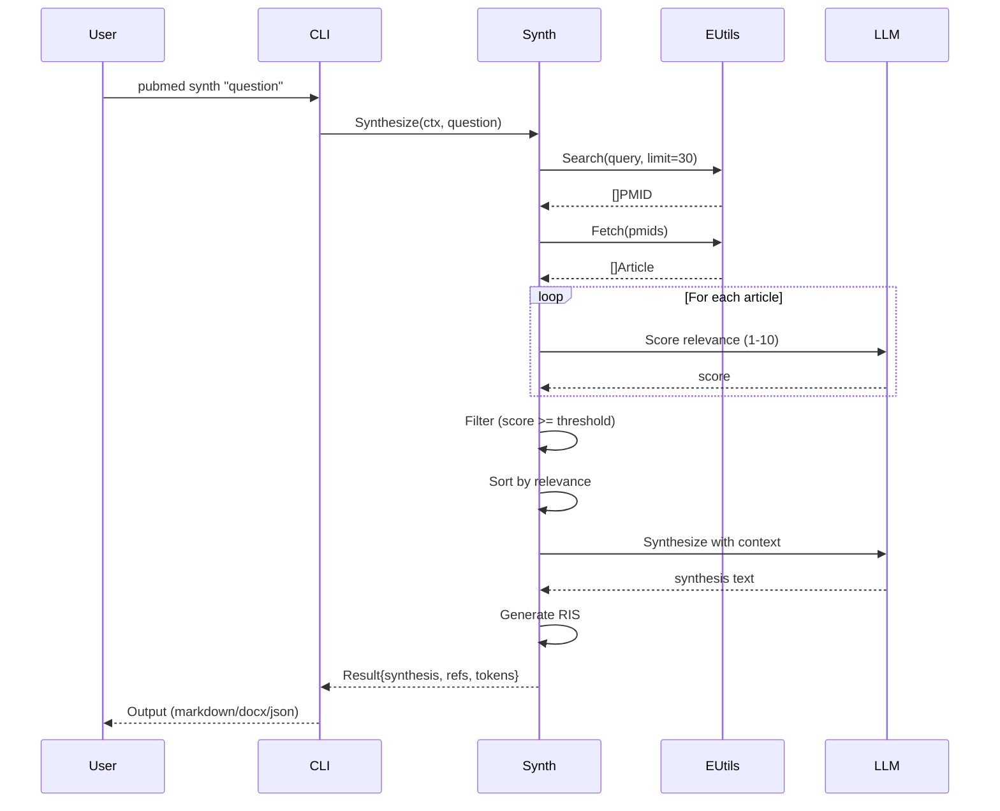
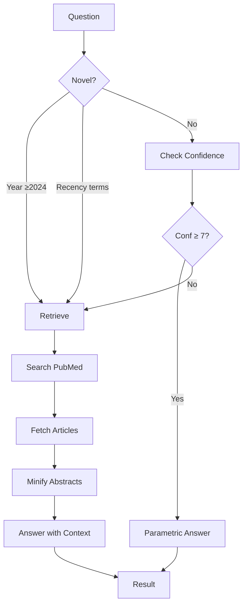

# Technical Design Document: pubmed-cli

## 1. Executive Summary

### 1.1 Document Information

| Version | Date | Author | Changes |
|---------|------|--------|---------|
| 1.0 | 2026-02-07 | Henry | Initial TDD |

### 1.2 Overview

`pubmed-cli` is a Go command-line tool for interacting with NCBI PubMed's E-utilities API. It provides 10 commands for searching, fetching, traversing citation networks, performing AI-powered literature synthesis, and answering biomedical questions. The tool is designed for both human interactive use and as a tool-use backend for LLM agents.

**Key Statistics:**
- **Version:** 0.5.1
- **Language:** Go 1.25.6
- **Total LOC:** 12,195 (6,131 source, 6,064 tests)
- **Test Coverage:** 58.8% overall
- **Commands:** 10 (wizard, synth, search, fetch, cited-by, references, related, mesh, qa, config)
- **Project Start:** 2026-02-04
- **Latest Release:** 2026-02-07

### 1.3 Key Problems Addressed

1. **RAG limitations for biomedical QA** — Traditional RAG retrieves by similarity, not relevance; pubmed-cli uses adaptive retrieval with confidence gating
2. **LLM tool access to PubMed** — Structured JSON output enables direct tool-use integration
3. **Literature synthesis workflow** — Combines search, relevance scoring, and synthesis with proper citations
4. **Rate limit compliance** — NCBI-compliant rate limiting (3/10 req/s) with shared limiter across clients

### 1.4 Architecture Decisions

| Decision | Rationale |
|----------|-----------|
| Single binary, 10 subcommands | Zero dependencies, ~5ms startup, portable |
| Cobra for CLI framework | Industry standard, good completion support |
| Charm libraries for TUI | Beautiful terminal forms without external dependencies |
| Shared BaseClient for NCBI | Single rate limiter, consistent parameter injection |
| CLI wrappers for Claude/Codex | OAuth via existing CLI auth, no API key management |

### 1.5 Success Metrics

| Metric | Current | Target |
|--------|---------|--------|
| Test Coverage | 58.8% | 80% |
| Max Cyclomatic Complexity | 19 (`Synthesize`) | <15 |
| CLI Function Complexity | ≤10 | ≤10 ✅ |
| Startup Time | ~5ms | <50ms ✅ |
| Rate Limit Compliance | 3/10 rps | NCBI compliant ✅ |

### 1.6 Stakeholders

| Role | Name | Responsibility |
|------|------|----------------|
| Author | Ernie Pedapati | Requirements, research validation |
| Maintainer | Henry | Implementation, testing |
| Users | AI agents, researchers | Tool consumers |

---

## 2. Background and Context

### 2.1 Software History

- **Created:** 2026-02-04
- **Original Purpose:** CLI for biomedical literature search and AI-powered synthesis
- **Key Milestones:**
  - 2026-02-04: v0.1.0 — Initial release (6 commands)
  - 2026-02-05: v0.1.1 — Critical rate limiter fix
  - 2026-02-07: v0.3.0 — QA command with adaptive retrieval
  - 2026-02-07: v0.4.0 — Synth command with citations
  - 2026-02-07: v0.5.0 — Interactive wizard mode
  - 2026-02-07: v0.5.1 — Codex code review fixes

### 2.2 Business/Domain Problem

LLM agents need structured access to biomedical literature. Traditional approaches:
1. **RAG** — Retrieves by embedding similarity, not task relevance
2. **Direct API** — Requires XML parsing, rate limit handling, complex queries
3. **Web scraping** — Fragile, violates TOS

pubmed-cli solves this by providing:
- Structured JSON output for agent consumption
- Adaptive retrieval that only fetches when needed
- Literature synthesis with proper academic citations
- NCBI-compliant rate limiting built in

### 2.3 External Dependencies

| Dependency | Version | Purpose | License |
|------------|---------|---------|---------|
| cobra | 1.10.2 | CLI framework | Apache-2.0 |
| bubbletea | 1.3.10 | Terminal UI framework | MIT |
| huh | 0.8.0 | Interactive forms | MIT |
| lipgloss | 1.1.0 | Terminal styling | MIT |
| golang.org/x/time | 0.14.0 | Rate limiting | BSD-3 |
| golang.org/x/text | 0.23.0 | Text processing | BSD-3 |

### 2.4 External Services

| Service | Purpose | Rate Limits |
|---------|---------|-------------|
| NCBI E-utilities | PubMed search, fetch, links | 3 req/s (10 with API key) |
| OpenAI API | LLM completions (optional) | Per-account |
| Claude CLI | LLM via OAuth (optional) | Per-subscription |
| Codex CLI | LLM via OAuth (optional) | Per-subscription |

### 2.5 Glossary

| Term | Definition |
|------|------------|
| PMID | PubMed Identifier — unique ID for each article |
| MeSH | Medical Subject Headings — controlled vocabulary for indexing |
| E-utilities | NCBI's public API for Entrez databases |
| Adaptive retrieval | Only fetch evidence when model confidence is low |
| Confidence gating | Use threshold (default 7/10) to decide retrieval need |

---

## 3. Current State Analysis (As-Is)

### 3.1 Architecture Overview

#### 3.1.1 High-Level Architecture

```
┌─────────────────────────────────────────────────────────────────────┐
│                         CLI Layer (Cobra)                           │
│  cmd/pubmed/{main.go, synth.go, wizard.go, qa.go, config.go}       │
├─────────────────────────────────────────────────────────────────────┤
│                         Domain Layer                                │
│  ┌─────────────┐  ┌─────────────┐  ┌─────────────┐                 │
│  │   synth/    │  │    qa/      │  │   mesh/     │                 │
│  │  engine.go  │  │ adaptive.go │  │  mesh.go    │                 │
│  │  ris.go     │  └─────────────┘  └─────────────┘                 │
│  │  bibtex.go  │                                                    │
│  │ relevance.go│                                                    │
│  └─────────────┘                                                    │
├─────────────────────────────────────────────────────────────────────┤
│                      Infrastructure Layer                           │
│  ┌─────────────┐  ┌─────────────┐  ┌─────────────┐                 │
│  │   eutils/   │  │    llm/     │  │  output/    │                 │
│  │  client.go  │  │  client.go  │  │  format.go  │                 │
│  │  search.go  │  │  claude.go  │  │  human.go   │                 │
│  │  fetch.go   │  │  codex.go   │  │   csv.go    │                 │
│  │  link.go    │  │ security.go │  └─────────────┘                 │
│  │  types.go   │  │ sanitize.go │                                   │
│  └─────────────┘  └─────────────┘                                   │
├─────────────────────────────────────────────────────────────────────┤
│                         Shared Layer                                │
│  ┌─────────────────────────────────────────────────────┐           │
│  │                    ncbi/client.go                    │           │
│  │  BaseClient: rate limiter, params, response guards   │           │
│  └─────────────────────────────────────────────────────┘           │
└─────────────────────────────────────────────────────────────────────┘
```

#### 3.1.2 Module/Component Breakdown

| Module | Purpose | LOC | Test Coverage | Health |
|--------|---------|-----|---------------|--------|
| cmd/pubmed | CLI entry point + commands | 1,901 | 8.5% | 🟡 |
| internal/eutils | NCBI E-utilities client | 1,234 | 93.1% | 🟢 |
| internal/llm | LLM clients (OpenAI, Claude, Codex) | 925 | 53.4% | 🟡 |
| internal/synth | Literature synthesis engine | 1,100 | 75.9% | 🟢 |
| internal/qa | Adaptive retrieval QA | 363 | 94.0% | 🟢 |
| internal/mesh | MeSH term lookup | 164 | 87.5% | 🟢 |
| internal/ncbi | Shared NCBI base client | 155 | 87.5% | 🟢 |
| internal/output | Output formatters | 847 | 72.5% | 🟢 |

### 3.2 Code Metrics and Health Check

#### 3.2.1 Size Metrics

```
Total LOC:          12,195
├── Source:          6,131
├── Tests:           6,064
├── Files:             43
└── Packages:           8
```

#### 3.2.2 Largest Source Files

| File | LOC | Purpose |
|------|-----|---------|
| cmd/pubmed/synth.go | 615 | Synthesis command |
| cmd/pubmed/wizard.go | 602 | Interactive wizard |
| internal/output/human.go | 438 | Rich terminal output |
| internal/qa/adaptive.go | 363 | Adaptive QA engine |
| internal/eutils/fetch.go | 296 | Article fetching |
| cmd/pubmed/main.go | 294 | Root command + basic commands |

#### 3.2.3 Complexity Analysis

| Function | Complexity | File | Status |
|----------|------------|------|--------|
| Synthesize | 19 | synth/engine.go | 🟡 Needs refactoring |
| runSynth | 5 | cmd/synth.go | 🟢 Refactored from 45 |
| runWizard | 6 | cmd/wizard.go | 🟢 Refactored from 29 |
| runQA | 4 | cmd/qa.go | 🟢 Refactored from 17 |
| MinifyAbstract | 9 | qa/adaptive.go | 🟢 Acceptable |

#### 3.2.4 Test Coverage by Package

| Package | Coverage | Gaps |
|---------|----------|------|
| internal/qa | 94.0% | Edge cases |
| internal/eutils | 93.1% | Integration |
| internal/mesh | 87.5% | Error paths |
| internal/ncbi | 87.5% | Edge cases |
| internal/synth | 75.9% | Complex flows |
| internal/output | 72.5% | Human mode |
| internal/llm | 53.4% | CLI integrations |
| cmd/pubmed | 8.5% | Most commands |

#### 3.2.5 Security Assessment

| Area | Status | Notes |
|------|--------|-------|
| Prompt injection | 🟢 Mitigated | Sanitization + detection in llm/sanitize.go |
| Shell injection | 🟢 Safe | exec.Command bypasses shell |
| Rate limiting | 🟢 Compliant | Token bucket via x/time/rate |
| Response size | 🟢 Limited | 50MB max via io.LimitReader |
| Sandbox modes | 🟢 Implemented | read-only default, opt-in full access |

### 3.3 Data Flow

#### 3.3.1 Synthesis Flow



#### 3.3.2 Adaptive QA Flow



### 3.4 Pain Points and Technical Debt

| Item | Type | Impact | Location |
|------|------|--------|----------|
| Low cmd coverage | Test gap | High | cmd/pubmed/*.go |
| Synthesize complexity | Code smell | Medium | synth/engine.go |
| Token estimation | Approximation | Low | `len(text)/4` used |
| No integration tests for LLM | Test gap | Medium | llm/*.go |
| Hardcoded prompts | Maintainability | Low | synth/engine.go, qa/adaptive.go |

### 3.5 Resolved Issues (from CODE_REVIEW.md)

All critical and major issues from the initial code review have been fixed:

| Issue | Status | Commit |
|-------|--------|--------|
| Rate limiting race condition | ✅ Fixed | Using x/time/rate |
| MeSH client rate limiting | ✅ Fixed | Shared BaseClient |
| Response size limits | ✅ Fixed | io.LimitReader 50MB |
| Publication type quoting | ✅ Fixed | Proper quotes |
| XML parsing edge cases | ✅ Fixed | MedlineDate, CollectiveName, nested tags |
| Context propagation | ✅ Fixed | cmd.Context() used |
| Search count parse errors | ✅ Fixed | Error returned |

---

## 4. Requirements and Constraints

### 4.1 Functional Requirements

#### Must-Have (Invariants)
- Search PubMed with Boolean/MeSH queries
- Fetch full article metadata by PMID
- Traverse citation networks (cited-by, references, related)
- Look up MeSH terms
- Answer yes/no biomedical questions with adaptive retrieval
- Synthesize literature with inline citations
- Output structured JSON for agent consumption
- Respect NCBI rate limits (3/10 req/s)

#### Nice-to-Have
- Interactive wizard mode ✅ Implemented
- Word document export ✅ Implemented
- RIS export for reference managers ✅ Implemented
- BibTeX export (partial, internal only)

### 4.2 Non-Functional Requirements

| Category | Requirement | Current |
|----------|-------------|---------|
| Performance | Startup <50ms | ~5ms ✅ |
| Performance | Single request <2s | Depends on NCBI |
| Reliability | Graceful degradation | Fallback to parametric |
| Portability | Single static binary | ✅ |
| Compliance | NCBI usage policy | ✅ Rate limited |
| Security | Prompt injection mitigation | ✅ Sanitization |

### 4.3 Constraints

- **Technical:** Go 1.25+, NCBI E-utilities API
- **Rate Limits:** 3 req/s without key, 10 req/s with NCBI API key
- **LLM Backends:** OpenAI API, Claude CLI, or Codex CLI (at least one required for qa/synth)
- **Binary Size:** Should remain reasonable (~15MB stripped)

### 4.4 Goals and Non-Goals

**Goals:**
- Provide reliable CLI access to PubMed for humans and agents
- Implement confidence-gated adaptive retrieval for QA
- Generate properly cited literature syntheses
- Maintain high test coverage for core packages

**Non-Goals:**
- Full-text article access (PubMed Central integration)
- Embedding/vector database integration (intentionally avoided)
- GUI or web interface
- Real-time streaming (batch processing only)

---

## 5. Proposed Improvements (To-Be Design)

### 5.1 Test Coverage Enhancement

Current gaps and solutions:

| Package | Current | Target | Approach |
|---------|---------|--------|----------|
| cmd/pubmed | 8.5% | 60% | Table-driven command tests with mocked clients |
| internal/llm | 53.4% | 80% | Mock exec.Command for CLI wrappers |

### 5.2 Complexity Reduction

The `Synthesize` function (complexity 19) should be refactored:

```go
// Current: Synthesize does everything
func (e *Engine) Synthesize(ctx, question) (*Result, error)

// Proposed: Extract pipeline steps
func (e *Engine) Synthesize(ctx, question) (*Result, error) {
    articles, err := e.searchAndFetch(ctx, question)
    scored, tokens, err := e.scoreArticles(ctx, question, articles)
    relevant := e.filterAndSort(scored)
    refs := e.buildReferences(relevant)
    synthesis, tokens, err := e.generateSynthesis(ctx, question, relevant)
    return e.assembleResult(question, synthesis, refs, tokens)
}
```

### 5.3 Configuration Improvements

Prompts should be externalized:

```go
// Current: Hardcoded in code
prompt := fmt.Sprintf(`You are a scientific writer. Synthesize...`)

// Proposed: Template-based
type PromptConfig struct {
    RelevanceScoring string `json:"relevance_scoring"`
    Synthesis        string `json:"synthesis"`
    QAConfidence     string `json:"qa_confidence"`
}
```

### 5.4 Token Counting Accuracy

Current approximation (`len(text)/4`) should be replaced:

```go
// Option 1: Use tiktoken-go for accurate counting
import "github.com/pkoukk/tiktoken-go"

func countTokens(text, model string) int {
    enc, _ := tiktoken.EncodingForModel(model)
    return len(enc.Encode(text, nil, nil))
}

// Option 2: Keep approximation but document clearly
// Current ~4 chars/token is reasonable for English text
```

---

## 6. File Structure Reference

```
pubmed-cli/
├── cmd/pubmed/                    # CLI entry point (Cobra)
│   ├── main.go                    # Root command + search/fetch/mesh/link (294 LOC)
│   ├── main_test.go               # Command tests
│   ├── synth.go                   # Synthesis command (555 LOC)
│   ├── wizard.go                  # Interactive wizard (602 LOC)
│   ├── qa.go                      # QA benchmark command (249 LOC)
│   └── config.go                  # Config management (201 LOC)
│
├── internal/
│   ├── eutils/                    # NCBI E-utilities client
│   │   ├── client.go              # Client wrapper around ncbi.BaseClient
│   │   ├── search.go              # ESearch implementation
│   │   ├── fetch.go               # EFetch implementation (XML parsing)
│   │   ├── link.go                # ELink implementation (cited-by, refs, related)
│   │   ├── types.go               # Article, Author, MeSHTerm types
│   │   └── *_test.go              # 93.1% coverage
│   │
│   ├── llm/                       # LLM client abstraction
│   │   ├── client.go              # OpenAI-compatible API client
│   │   ├── claude.go              # Claude CLI wrapper
│   │   ├── codex.go               # Codex CLI wrapper
│   │   ├── security.go            # Sandbox modes, security config
│   │   ├── sanitize.go            # Prompt validation and sanitization
│   │   └── *_test.go              # 53.4% coverage
│   │
│   ├── synth/                     # Literature synthesis engine
│   │   ├── engine.go              # Core synthesis workflow (615 LOC)
│   │   ├── relevance.go           # Per-article relevance scoring
│   │   ├── ris.go                 # RIS format export
│   │   ├── bibtex.go              # BibTeX format (internal)
│   │   └── *_test.go              # 75.9% coverage
│   │
│   ├── qa/                        # Adaptive retrieval QA
│   │   ├── adaptive.go            # Confidence-gated retrieval (363 LOC)
│   │   └── adaptive_test.go       # 94.0% coverage
│   │
│   ├── mesh/                      # MeSH term lookup
│   │   ├── mesh.go                # ESummary-based lookup
│   │   └── *_test.go              # 87.5% coverage
│   │
│   ├── ncbi/                      # Shared NCBI infrastructure
│   │   ├── client.go              # BaseClient: rate limiter, params, guards
│   │   └── client_test.go         # 87.5% coverage
│   │
│   └── output/                    # Output formatters
│       ├── format.go              # Format dispatcher
│       ├── human.go               # Rich terminal output (438 LOC)
│       ├── csv.go                 # CSV export
│       └── *_test.go              # 72.5% coverage
│
├── go.mod                         # Go 1.25.6, dependencies
├── go.sum                         # Dependency checksums
├── Makefile                       # Build, test, release targets
├── README.md                      # User documentation
├── CHANGELOG.md                   # Version history
├── CODE_REVIEW.md                 # Review findings and fixes
├── RELEASING.md                   # Release process
└── UX_TESTING.md                  # Persona-based UX testing report
```

---

## 7. Command Reference

### 7.1 Command Summary

| Command | Purpose | LLM Required |
|---------|---------|--------------|
| `wizard` | Interactive synthesis wizard | Yes |
| `synth` | Literature synthesis with citations | Yes |
| `search` | Search PubMed | No |
| `fetch` | Get article details | No |
| `cited-by` | Find citing papers | No |
| `references` | Find referenced papers | No |
| `related` | Find similar papers | No |
| `mesh` | Look up MeSH terms | No |
| `qa` | Answer yes/no questions | Yes |
| `config` | Manage wizard settings | No |

### 7.2 Global Flags

| Flag | Description | Default |
|------|-------------|---------|
| `--json` | Structured JSON output | false |
| `--human`, `-H` | Rich terminal display | false |
| `--limit N` | Max results | 20 |
| `--sort` | relevance \| date \| cited | relevance |
| `--year` | Year range (e.g., 2020-2025) | — |
| `--type` | review \| trial \| meta-analysis | — |
| `--api-key` | NCBI API key | $NCBI_API_KEY |
| `--csv` | Export to CSV file | — |

### 7.3 LLM Backend Flags

| Flag | Backend | Authentication |
|------|---------|----------------|
| (default) | OpenAI API | $LLM_API_KEY or $OPENAI_API_KEY |
| `--claude` | Claude CLI | OAuth via `claude login` |
| `--codex` | Codex CLI | OAuth via `codex login` |
| `--opus` | Claude Opus | Longer timeout, more capable |
| `--unsafe` | Full sandbox | Skip permission checks |

---

## 8. Testing Strategy

### 8.1 Test Categories

| Type | Coverage | Location | Run Command |
|------|----------|----------|-------------|
| Unit | 58.8% | `*_test.go` | `go test ./...` |
| Integration | Manual | `*_integration_test.go` | `go test -tags=integration` |
| Race | CI | — | `go test -race ./...` |

### 8.2 Test Fixtures

Located in package directories, e.g., `internal/eutils/testdata/`:
- `search_response.json` — Sample ESearch response
- `fetch_response.xml` — Sample EFetch XML
- `mesh_summary.json` — Sample MeSH ESummary

### 8.3 Mocking Strategy

- **HTTP:** `httptest.Server` for NCBI API responses
- **LLM:** Interface-based mocking (`synth.LLMClient`, `qa.LLMClient`)
- **CLI:** `exec.Command` stubbing for Claude/Codex tests

---

## 9. Security Model

### 9.1 Threat Model

```
┌─────────────────────────────────────────────────────────────┐
│                    Threat Landscape                          │
├─────────────────────────────────────────────────────────────┤
│  1. Prompt Injection                                         │
│     └─ Malicious content in PubMed abstracts                │
│     └─ Mitigation: Sanitization + pattern detection         │
│                                                              │
│  2. Shell Injection                                          │
│     └─ User input reaching shell                            │
│     └─ Mitigation: exec.Command bypasses shell              │
│                                                              │
│  3. Resource Exhaustion                                      │
│     └─ Large API responses consuming memory                 │
│     └─ Mitigation: io.LimitReader (50MB max)               │
│                                                              │
│  4. Rate Limit Violation                                     │
│     └─ Concurrent requests exceeding NCBI limits            │
│     └─ Mitigation: Token bucket rate limiter                │
└─────────────────────────────────────────────────────────────┘
```

### 9.2 Sandbox Modes

| Mode | Flag | Behavior |
|------|------|----------|
| `read-only` | (default) | LLM can only read and respond |
| `workspace-write` | — | Allows file creation in cwd |
| `danger-full-access` | `--unsafe` | Bypasses all restrictions |

### 9.3 Input Validation

```go
// From internal/llm/sanitize.go
func SanitizePromptWithConfig(prompt string, cfg SecurityConfig) (string, error) {
    // 1. Length check
    if len(prompt) > cfg.MaxPromptLength { return "", ErrPromptTooLong }
    
    // 2. Null byte check
    if strings.ContainsRune(prompt, 0) { return "", ErrNullByte }
    
    // 3. Shell metachar check (optional)
    if !cfg.AllowShellMetachars && hasShellMetachars(prompt) { return "", ErrShellChars }
    
    // 4. Injection pattern detection (optional)
    if cfg.BlockPromptInjection && hasInjectionPatterns(prompt) { return "", ErrInjection }
    
    return prompt, nil
}
```

---

## 10. Appendix

### A. Environment Variables

| Variable | Purpose | Example |
|----------|---------|---------|
| `NCBI_API_KEY` | NCBI E-utilities API key | `abc123...` |
| `LLM_API_KEY` | OpenAI-compatible API key | `sk-...` |
| `LLM_BASE_URL` | Custom LLM endpoint | `https://api.example.com/v1` |
| `LLM_MODEL` | Model name | `gpt-4o` |
| `OPENAI_API_KEY` | Fallback for LLM_API_KEY | `sk-...` |

### B. Configuration Files

| File | Purpose |
|------|---------|
| `~/.config/pubmed-cli/config.json` | Wizard defaults (papers, words, output dir) |
| `~/Documents/PubMed Syntheses/` | Default output directory |

### C. Build and Release

```bash
# Build
go build -o pubmed ./cmd/pubmed

# Test
go test ./...
go test -race ./...
go test -cover ./...

# Release (see RELEASING.md)
make release VERSION=0.5.2
```

### D. References

- [NCBI E-utilities Documentation](https://www.ncbi.nlm.nih.gov/books/NBK25501/)
- [NCBI API Key Registration](https://www.ncbi.nlm.nih.gov/account/settings/)
- [Cobra CLI Framework](https://github.com/spf13/cobra)
- [Charm Terminal Libraries](https://charm.sh/)

---

*Document generated: 2026-02-07*
